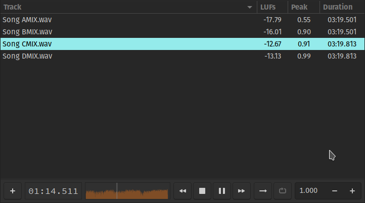

# Alphabet

Alphabet is simple gtk-3 music player.\
It's main focus is to allow precise comparison between similar music files, aka A-B testing.\
By default all audio files are gain-matched to the track with lowest average loudness according to ebu R128.\
Playback can be either continuous, where the user can switch files seamlessly without interruption.\
A marker can be placed in the timeline to reset the playback on file selection or play/pause.\
Alternatively, the user can loop a specified region.\
Files can be opened in alphabet (file chooser), from the file manager (must use .app bundle on MacOs), command-line arguments or dragged into alphabet (only in linux so far).

### doc
[manual](doc/alphabet.md)

### install
    make install

### .app bundle
    make app

### .deb pkg
    make deb

### makefile help
    make help
